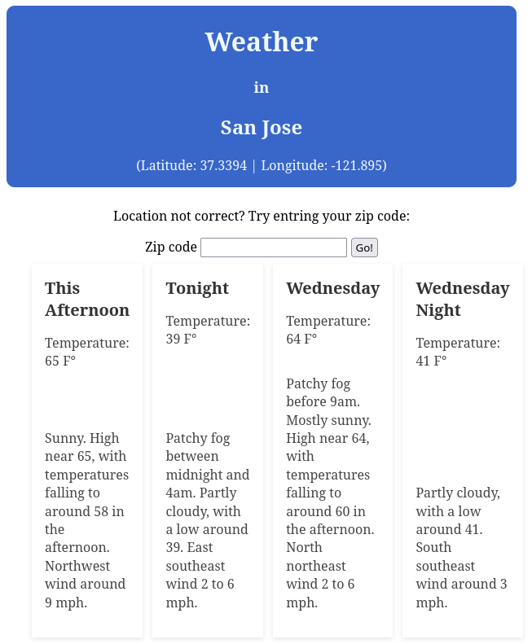

# Weather App

A simple web-based frontend, built using Flask, to check the weather at your location utilizing the [US National Weather Service API](https://www.weather.gov/documentation/services-web-api).



The app should auto-detect your devices location, though if this fails, or the ip detection isn't your actual location(possibly from using a VPN), you can enter your zip code. The app uses your latitude and longitude to query the US Weather Service API for the nearest grid to you and then query the api again, using the grid info it gets from the first query,to get the current weather data

## Installation

Using the command prompt in a terminal:

* Clone the repository
```git clone https://github.com/Fediry/weather_app.git```
* Change to the new app directory
```cd weather_app```
* Install dependencies with Poetry
```poetry install```
(Dependencies are handled by poetry.)
    * Flask
    * geocoder
    * pandas

## Usage

Still using the command prompt in the `weather_app` directory:

* Create a virtual environment
```poetry shell```
* Run the app
```flask run```
* Use your webbrowser to visit [127.0.0.1:5000](http://127.0.0.1:5000)

The app should load in your browser.
